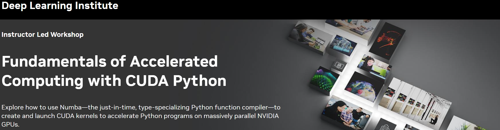

## Table of Contents
1. [Description](#description)
2. [Information](#information)
3. [Certificate](#certificate)

## Description

This course explores how to use Numba—the just-in-time, type-specializing Python function compiler—to accelerate Python programs to run on massively parallel NVIDIA GPUs. 

You’ll learn how to:
- Use Numba to compile CUDA kernels from NumPy universal functions (ufuncs);
- Use Numba to create and launch custom CUDA kernels;
- Apply key GPU memory management techniques.
-
- Upon completion, you’ll be able to use Numba to compile and launch CUDA kernels to accelerate your Python applications on NVIDIA GPUs.

## Information
At the conclusion of the workshop, you’ll have an understanding of the fundamental tools and techniques for GPU-accelerated Python applications with CUDA and Numba:

> - GPU-accelerate NumPy ufuncs with a few lines of code.
> - Configure code parallelization using the CUDA thread hierarchy.
> - Write custom CUDA device kernels for maximum performance and flexibility.
> - Use memory coalescing and on-device shared memory to increase CUDA kernel bandwidth.

More detailed information and links for the course can be found on the [course website](https://www.nvidia.com/en-in/training/instructor-led-workshops/fundamentals-of-accelerated-computing-with-cuda-python/).

## Certificate

The certificate for the course can be found below:

- ["Fundamentals of Accelerated Computing with CUDA Python" - NVIDIA Deep Learning Institute]() (Issued On: November 2024)
